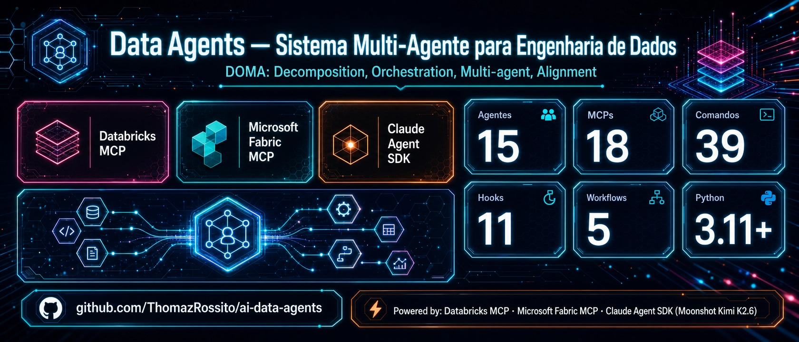
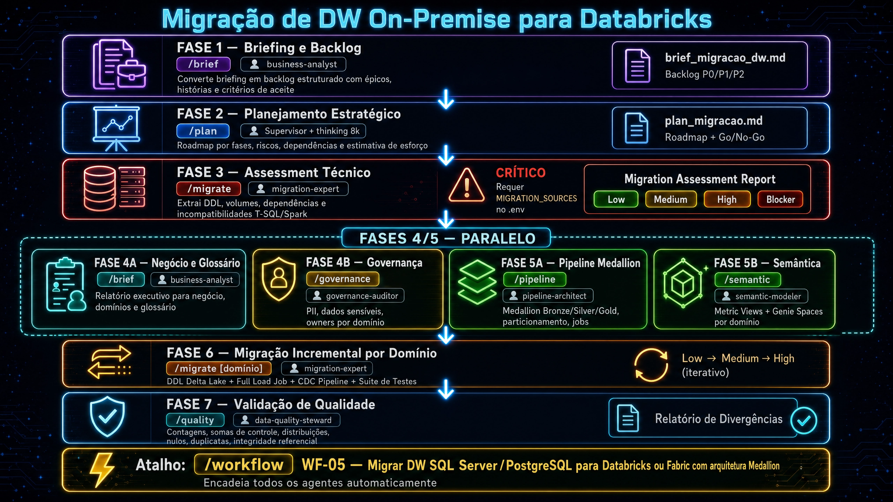
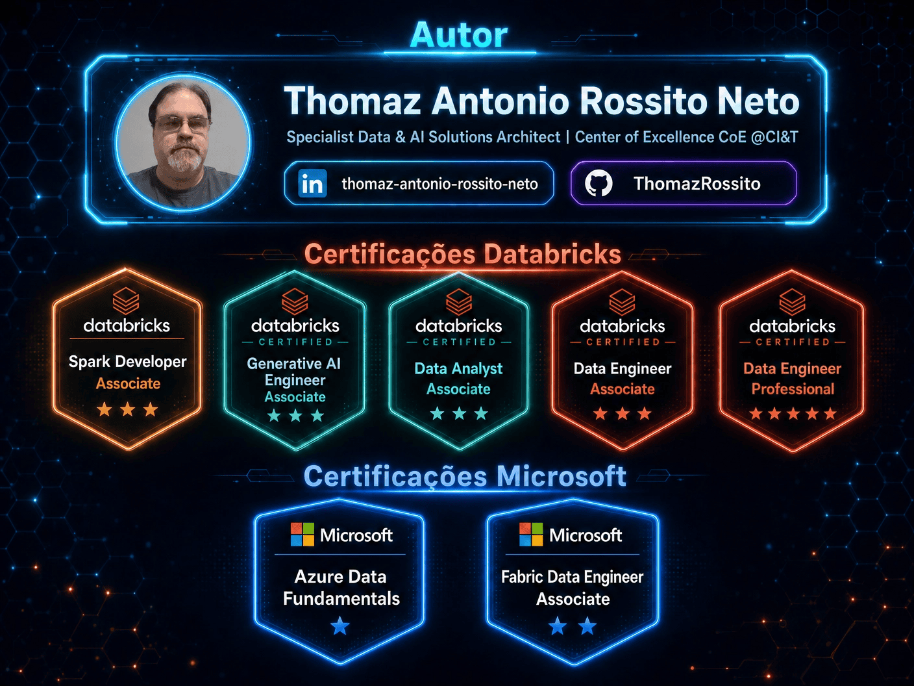

<p align="center">
  
</p>

<p align="center">
  
  
  
  
  
  
</p>

---

> ⭐ Se o AI Data Agents foi útil para você, deixe uma estrela — ajuda o projeto a crescer!

<details>
<summary>📋 Índice</summary>

- [O que é o AI Data Agents?](#o-que-é-o-data-agents)
- [Arquitetura](#arquitetura)
- [Início Rápido](#início-rápido)
- [Agentes Especialistas](#agentes-especialistas)
- [Comandos Disponíveis](#comandos-disponíveis)
- [Protocolo DOMA & Workflows Colaborativos](#protocolo-doma--workflows-colaborativos)
- [Migração de DW On-Premise para Databricks](#migração-de-dw-on-premise-para-databricks)
- [Catalog Intelligence](#catalog-intelligence)
- [Fabric Ontology](#fabric-ontology--web-semântica-no-fabric)
- [Knowledge Base de Indústria](#knowledge-base-de-indústria)
- [Confiabilidade e Proteção de Qualidade](#confiabilidade-e-proteção-de-qualidade)
- [Plataformas e MCPs](#plataformas-e-mcps)
- [Camada de Proteção](#camada-de-proteção)
- [Sistema de Memória](#sistema-de-memória)
- [Interfaces](#interfaces)
- [Qualidade e CI/CD](#qualidade-e-cicd)
- [Configurações Avançadas](#configurações-avançadas)
- [Sobre o Autor](#sobre-o-autor)
- [Licença](#licença)

</details>

---

## O que é o AI Data Agents?

**AI Data Agents** é um sistema multi-agente construído sobre o **Claude Agent SDK** da Anthropic com integração nativa via **Model Context Protocol (MCP)** ao **Databricks** e **Microsoft Fabric**. Em vez de um único assistente genérico, o sistema orquestra **<!-- INVENTORY:agents_total -->15<!-- /INVENTORY:agents_total --> agentes especialistas** que operam diretamente nas suas plataformas de dados, cada um com seu domínio de conhecimento, ferramentas e regras corporativas declarativas.

---

## Arquitetura

<p align="center">
  
</p>


Você envia uma mensagem — seja pelo terminal, pela interface web ou com um comando slash. O **Supervisor** lê a solicitação, consulta as bases de conhecimento do projeto, planeja a solução e delega para os agentes especialistas certos. Cada agente usa as ferramentas MCP para operar diretamente no Databricks ou no Microsoft Fabric e devolve o resultado para o Supervisor consolidar.

**O Supervisor nunca escreve código ou acessa dados diretamente** — ele coordena. Os especialistas executam.

---

## Início Rápido

> **Dois canais de instalação** — escolha um (ou os dois, eles coexistem):
>
> **(A) Python CLI** — feature set completo: Supervisor, 39 slash commands, 17 MCPs, hooks de segurança, memória persistente, audit JSONL. É o que está descrito abaixo.
>
> **(B) Claude Code plugin** — apenas os 15 agentes + 48 skills dentro do seu Claude Code. Use se você já usa o Claude Code e quer os agentes nativamente:
>
> ```bash
> claude plugin marketplace add ThomazRossito/ai-data-agents
> claude plugin install ai-data-agents@thomazrossito-marketplace
> ```
>
> Comparação completa em [`docs/site/getting-started/installation.md`](docs/site/getting-started/installation.md).

```bash
# 1. Clone e entre no diretório
git clone git@github.com:ThomazRossito/ai-data-agents.git && cd ai-data-agents

# 2. Crie o ambiente
conda create -n ai-data-agents python=3.12 && conda activate ai-data-agents

# 3. Instale dependências
pip install -e ".[dev,ui,monitoring]"

# 3a. (Opcional) Habilitar Ontology Engineer — rdflib + owlready2
pip install -e ".[ontology]"

# 4. Configure credenciais (escolha uma)
make bootstrap         # wizard interativo: cria .env mínimo em ~2 min
cp .env.example .env   # ou copie e edite manualmente com suas chaves

# 5. Smoke test end-to-end (só precisa de ANTHROPIC_API_KEY, ~$0.005)
make demo

# 6a. Web UI (Chainlit + Monitoring)
./start.sh             # http://localhost:8513 (Chat) + http://localhost:8511 (Monitoring)

# 6b. Terminal
python main.py         # ou: make run
```

> **Primeira vez?** `make bootstrap && make demo` valida seu setup em <5 minutos, sem precisar configurar Databricks ou Fabric.

### Credenciais no `.env`

| Variável | Obrigatória | Plataforma |
|----------|-------------|------------|
| `ANTHROPIC_API_KEY` | Sim | Claude API |
| `DATABRICKS_HOST`, `DATABRICKS_TOKEN` | Não | Databricks |
| `AZURE_TENANT_ID`, `FABRIC_WORKSPACE_ID` | Não | Microsoft Fabric |
| `DATABRICKS_GENIE_SPACES` | Não | Databricks Genie (Conversational BI) |
| `FABRIC_SQL_LAKEHOUSES` | Não | Fabric SQL Analytics Endpoint |
| `KUSTO_SERVICE_URI` | Não | Fabric Real-Time Intelligence (KQL) |
| `TAVILY_API_KEY` | Não | Busca web |
| `GITHUB_PERSONAL_ACCESS_TOKEN` | Não | GitHub MCP |
| `FIRECRAWL_API_KEY` | Não | Web scraping |
| `POSTGRES_URL` | Não | PostgreSQL MCP |
| `MIGRATION_SOURCES` | Não | Migration Source MCP (SQL Server/PostgreSQL de origem) |
| `TIER_MODEL_MAP` | Não | Override de modelo por tier (T1/T2/T3) |

> O sistema ativa automaticamente apenas as plataformas com credenciais configuradas. `context7` e `memory_mcp` são ativados sempre, sem credenciais.

---

## Agentes Especialistas

### Tier 1 — Engineering Core

| Agente | Comando(s) | O que faz |
|--------|-----------|-----------|
| **Supervisor** | `/plan` | Coordena, planeja e valida tudo contra a Constituição — nunca executa código ou acessa MCP diretamente |
| **Databricks Engineer** | `/sql`, `/spark`, `/pipeline`, `/cdc`, `/diagnose`, `/genie`, `/dashboard` | SQL (Unity Catalog, Spark SQL), PySpark, Delta Lake, LakeFlow/DLT, CDC (Debezium + AUTO CDC INTO), Jobs, diagnóstico Spark (OOM/skew/shuffle), Genie Spaces, AI/BI Dashboards, KA/MAS |
| **Databricks AI** | `/ai`, `/streaming` | RAG pipelines, Vector Search, embeddings, feature stores, LLMOps com MLflow, AI Functions (AI_QUERY/AI_SUMMARIZE), Kafka, Flink, Spark Structured Streaming |
| **Fabric Engineer** | `/fabric`, `/semantic`, `/schema`, `/finops`, `/catalog`, `/medallion` | Fabric completo: Medallion (Bronze/Silver/Gold), Data Factory, Star Schema / Data Vault 2.0, Semantic Models, DAX, Direct Lake, Genie Spaces, catálogo de dados, governança, FinOps (DBU/CU) |
| **Migration Expert** | `/migrate` | Assessment e migração de SQL Server/PostgreSQL para Databricks ou Fabric; auto-revisão de DDL, conversão de tipos, namespace completo |
| **Python Expert** | `/python` | Python puro: pacotes, automação, APIs REST, CLIs, testes, pandas/polars |

### Tier 2 — Specialized

| Agente | Comando(s) | O que faz |
|--------|-----------|-----------|
| **dbt Expert** | `/dbt` | dbt Core: models, testes, snapshots, seeds, docs, lineage |
| **Data Quality Steward** | `/quality` | Validação de dados, profiling, schema drift, SLAs, alertas cross-platform |
| **Governance Auditor** | `/governance` | Auditoria de acessos, linhagem, PII, LGPD/GDPR, RLS/OLS/Sensitivity Labels |
| **Data Contracts Engineer** | `/contract` | Contratos ODCS, SLA de qualidade, schema governance, breaking change management |
| **Data Mesh Architect** | `/mesh` | Data Mesh: domínios de negócio, Data Products, governança federada, avaliação de maturidade |
| **Fabric RTI** | — | Fabric Real-Time Intelligence: Eventhouse, KQL, Eventstream, Activator — delegado pelo Fabric Engineer ou Supervisor |
| **Fabric Ontology** | `/ontology` | OWL 2, RDF, SPARQL, Fabric IQ Ontology — design, validação, import/export OneLake, triples → Delta |

### Tier 3 / T0 — Conversational

| Agente | Comando(s) | O que faz |
|--------|-----------|-----------|
| **Business Analyst** | `/brief`, `/ship` | Converte reuniões e briefings em backlog P0/P1/P2; gera SHIPPED docs com decisões e trade-offs |
| **Geral** | `/geral` | Respostas conceituais diretas — zero MCP, ~95% mais barato |

> Refresh de Skills é um script independente — `python scripts/refresh_skills.py` (não é mais um agente).

---

### Party Mode — Múltiplos Especialistas em Paralelo

O comando `/party` convoca múltiplos agentes simultaneamente para a mesma pergunta. Cada um responde de forma independente, com sua perspectiva de domínio.

```bash
/party qual a diferença entre Delta Lake e Iceberg?
# → databricks-engineer + databricks-ai + fabric-engineer respondem em paralelo

/party --quality como garantir qualidade em dados incrementais?
# → data-quality-steward + governance-auditor + fabric-rti

/party --engineering como processar um CSV de 10 GB com eficiência?
# → python-expert + databricks-engineer + databricks-ai

/party --migration como avaliar complexidade de migração de SQL Server?
# → migration-expert + databricks-engineer + fabric-engineer

/party --full explique o Unity Catalog
# → todos os T1 + principais T2 (9 especialistas em paralelo)
```

---

## Comandos Disponíveis

**Agentes Especialistas:**

| Comando | Agente | Descrição |
|---------|--------|-----------|
| `/sql <query>` | databricks-engineer | SQL (Spark SQL, Unity Catalog, DDL/DML) |
| `/spark <tarefa>` | databricks-engineer | PySpark, Delta Lake, Spark Declarative Pipelines |
| `/pipeline <tarefa>` | databricks-engineer | Pipeline ETL/ELT no Databricks (Jobs, LakeFlow) |
| `/cdc <tarefa>` | databricks-engineer | Change Data Capture: Debezium, AUTO CDC INTO, transactional outbox |
| `/diagnose <problema>` | databricks-engineer | Diagnóstico Spark: OOM, data skew, shuffle failure, hang |
| `/genie <tarefa>` | databricks-engineer | Criar/atualizar Genie Spaces para Conversational BI |
| `/dashboard <tarefa>` | databricks-engineer | Criar/publicar AI/BI Dashboards no Databricks |
| `/streaming <tarefa>` | databricks-ai | Kafka, Flink, Spark Structured Streaming, Fabric RTI |
| `/ai <tarefa>` | databricks-ai | RAG pipelines, Vector Search, embeddings, LLMOps, AI Functions |
| `/fabric <tarefa>` | fabric-engineer | Qualquer tarefa Microsoft Fabric |
| `/semantic <tarefa>` | fabric-engineer | DAX, Direct Lake, Metric Views, Semantic Models |
| `/schema <tarefa>` | fabric-engineer | Star Schema, Data Vault 2.0, SCD types, grain definition |
| `/finops <tarefa>` | fabric-engineer | FinOps: custo DBU/CU, rightsizing, otimização Delta |
| `/catalog <subcmd>` | fabric-engineer | Catálogo de dados: comentários, scan, discover, industry, value |
| `/medallion <tarefa>` | fabric-engineer | Design de camadas Bronze/Silver/Gold no Fabric |
| `/migrate <fonte> para <destino>` | migration-expert | Assessment e migração de banco relacional para Databricks/Fabric |
| `/python <tarefa>` | python-expert | Python puro: pacotes, testes, APIs, CLIs, automação |
| `/dbt <tarefa>` | dbt-expert | dbt Core: models, testes, snapshots, seeds, docs |
| `/quality <tarefa>` | data-quality-steward | Qualidade de dados cross-platform |
| `/governance <tarefa>` | governance-auditor | Auditoria, linhagem, PII, LGPD/GDPR, RLS/OLS |
| `/contract <tarefa>` | data-contracts-engineer | Data Contracts ODCS, SLA, schema governance, breaking changes |
| `/mesh <tarefa>` | data-mesh-architect | Data Mesh: domínios, Data Products, governança federada |
| `/ontology <tarefa>` | fabric-ontology | OWL 2, import/export OneLake, triples → Delta, Fabric IQ Ontology |
| `/geral <pergunta>` | geral | Resposta direta sem Supervisor — mais rápido e barato |

---

**Catalog Intelligence** _(via `/catalog` → fabric-engineer):_

| Subcomando | Descrição |
|------------|-----------|
| `/catalog comments <schema>` | Gera comentários de AI para tabelas e colunas de um schema |
| `/catalog scan [schema]` | Calcula Data Maturity Score (0–100, A–F) e exporta relatório em `output/catalog/` |
| `/catalog discover [schema]` | Descobre casos de uso de negócio para tabelas existentes |
| `/catalog industry <schema>` | Alinha tabelas a KPIs e casos de uso da indústria detectada |
| `/catalog value [schema]` | Business Value Engine: ranking de tabelas por valor com custo estimado de downtime |

---

**Orquestração e Sessão:**

| Comando | Descrição |
|---------|-----------|
| `/brief <texto>` | Converte transcript/briefing em backlog estruturado |
| `/ship <feature>` | Gera SHIPPED doc — decisões, trade-offs e próximos passos de uma feature entregue |
| `/plan <objetivo>` | Planejamento completo com thinking habilitado (8k tokens) |
| `/review <artefato>` | Review de código ou pipeline |
| `/party <query>` | Multi-agente paralelo (flags: `--quality`, `--arch`, `--engineering`, `--migration`, `--full`) |
| `/analyze-project [--quality\|--arch\|--databricks\|--fabric] [descrição]` | Análise completa do projeto: 4 especialistas em paralelo, relatório salvo em `output/analyze-project/` |
| `/workflow <wf-id> <query>` | Executa workflow colaborativo pré-definido (WF-01 a WF-05) com context chain |
| `/health` | Status das plataformas configuradas |
| `/status` | Estado da sessão atual |
| `/memory <query>` | Consulta à memória persistente (`/memory clear` para limpar com confirmação) |
| `/mcp [filtro]` | Status em tempo real dos MCP servers — quais estão ativos e quais precisam de credenciais |
| `/eval [all]` | Histórico de avaliações de qualidade das sessões (1–5 estrelas) |
| `/sessions [all\|<id>]` | Lista sessões registradas (transcript + checkpoint) |
| `/resume [last\|<id>]` | Retoma sessão anterior reconstruindo contexto do transcript |
| `/export` | Exporta o histórico da sessão para HTML (abra no browser → Cmd+P para PDF) |

---

## Protocolo DOMA & Workflows Colaborativos

O **Protocolo DOMA** (Data Orchestration Method for Agents) é o método de 7 passos que o Supervisor segue para toda tarefa complexa — de KB-First até Validação final. Os **Workflows Colaborativos** (WF-01 a WF-05) encadeiam agentes automaticamente para projetos end-to-end, desde pipelines Bronze→Gold até migrações relacionais para a nuvem.

<p align="center">
  
</p>

---

## Migração de DW On-Premise para Databricks

O fluxo de **migração** orquestra 7 fases em sequência — do briefing inicial ao relatório de divergências — usando os agentes certos em cada etapa. As fases 4/5 rodam em paralelo (governança + pipeline, semântica) e a fase 6 é iterativa por domínio (Low → Medium → High). O atalho `/workflow WF-05` encadeia tudo automaticamente.

<p align="center">
  
</p>

---

## Catalog Intelligence

O **Fabric Engineer** inclui capacidades de Catalog Intelligence — transforma catálogos de dados brutos em ativos documentados, avaliados e alinhados ao negócio. Opera sobre Unity Catalog (Databricks) e Fabric Lakehouse.

### Comandos `/catalog`

| Subcomando | O que entrega |
|------------|--------------|
| `comments` | Comandos `COMMENT ON TABLE/COLUMN` prontos para aplicar — granularidade, PII, Medallion layer |
| `scan` | Data Maturity Score em 5 dimensões (Catalogação, Qualidade, Governança, Performance, Adoção) com notas A–F e plano de ação priorizado; exporta `output/catalog/scan_<schema>_<date>.md` |
| `discover` | Casos de uso de negócio inferidos a partir de tabelas existentes cruzados com as KBs de indústria |
| `industry` | Mapa tabela → caso de uso → KPI com gaps identificados (o que está faltando para cobrir os use cases da vertical) |
| `value` | **Business Value Engine** — ranking de tabelas por score 0–100 (acesso, usuários, dependências, criticidade, Medallion) e estimativa de custo de downtime em R$/h |

```bash
/catalog scan production.silver
# → 📊 Score: 69/100 (C) + relatório exportado em output/catalog/scan_silver_2026-04-30.md

/catalog value production.gold
# → 💰 fct_transactions: Score 94/100 | Downtime est.: R$ 48.000/h

/catalog industry production.silver
# → 🏭 Verticais detectadas: Financial Services | 3 use cases cobertos, 2 com gap
```

---

## Fabric Ontology — Web Semântica no Fabric

<p align="center">
  
</p>

O agente **fabric-ontology** traz suporte a **OWL 2** (Web Ontology Language) ao ecossistema de dados — design de ontologias de domínio, import/export de arquivos para o Microsoft Fabric OneLake e integração com Delta Lake para consultas SQL sobre grafos semânticos.

> **Escopo atual:** OWL 2. **Roadmap:** SKOS → SPARQL endpoint → SHACL → Linked Data.

### O que o agente faz

| Tarefa | O que entrega |
|--------|--------------|
| **Design de ontologia** | T-Box em Turtle: classes, properties, axiomas, namespace canônico `https://ontologia.empresa.com.br/<dominio>/`, `rdfs:label` pt/en |
| **Import — arquivo local** | Valida (zero ERRORs obrigatório) → normaliza para Turtle → upload OneLake → notebook Spark → Delta `ontology_triples` com schema canônico |
| **Import — ontologia pública** | Busca com Tavily → scrape com Firecrawl → valida → upload em `Files/ontologies/raw/` (namespace original preservado) |
| **Import — item nativo Fabric** | Descobre via `list_items` (tipo Ontology) → inspeciona com `get_item_schema` → exporta via Spark lendo Delta do Lakehouse gerado automaticamente |
| **Export (Fabric → arquivo)** | Reconstrói grafo rdflib a partir do Delta → serializa em Turtle, RDF/XML, N-Triples ou JSON-LD |
| **Conversão de formatos** | `.owl` → `.ttl` → `.nt` → `.jsonld` — valida que nenhum triple é perdido na conversão |
| **Validação** | Detecta namespace placeholder (ERROR), `owl:Thing` como range (ERROR), `owl:Ontology`/`versionInfo`/labels ausentes (WARN) |
| **Views SQL** | Gera `vw_ontology_classes`, `vw_class_hierarchy`, `vw_ontology_labels` sobre o Delta de triples |

### Fabric Ontology Nativo

O Fabric tem um tipo de item nativo **Ontology** (criado pela UI do Fabric). Quando criado, ele provisiona automaticamente: Lakehouse (`<nome>_lh`), SQL Endpoint, GraphModel (`<nome>_graph`) e opcionalmente um SemanticModel. O agente sabe descobrir e exportar esses itens — use `list_items` (não `onelake_list_files`).

### Exemplo de uso

```
/ontology crie uma ontologia OWL para o domínio de RH com as classes Employee,
Department e Role, e gere o notebook Spark para ingestão no Fabric.
```

O agente: (1) cria o Turtle com namespace `https://ontologia.empresa.com.br/hr/`, (2) valida com zero ERRORs, (3) faz upload para `Files/ontologies/domain/` via MCP OneLake, (4) gera o notebook Spark completo com schema canônico (`graph`, `loaded_at`), (5) cria as views SQL.

### Infraestrutura

- **Bibliotecas:** `rdflib>=7.0`, `owlready2>=0.47` — instalar com `pip install -e ".[ontology]"`
- **Armazenamento:** OneLake Files (`Files/ontologies/`) + Delta Table `ontology_triples` com colunas `subject`, `predicate`, `object`, `graph`, `datatype`, `lang_tag`, `source_file`, `loaded_at`
- **MCPs usados:** `fabric_official` (OneLake file ops + workspace items), `fabric_community` (descoberta), `context7` (docs rdflib), `tavily`/`firecrawl` (ontologias públicas W3C, OBO, Schema.org)
- **Escalação:** `databricks-engineer` para notebooks em escala, `governance-auditor` para propriedades PII

---

## Knowledge Base de Indústria

O sistema inclui **10 verticais** de indústria com casos de uso, schemas de referência, KPIs e anti-padrões específicos — consultadas pelos agentes antes de qualquer análise:

| Vertical | Domínio de Conhecimento |
|----------|------------------------|
| **Financial Services** | Crédito (ECL/PD/LGD), AML/KYC, IFRS 9, Churn, NBO, Open Finance |
| **Retail** | Demand Forecasting, RFM, Dynamic Pricing, Omnichannel |
| **Manufacturing** | OEE, Manutenção Preditiva, SPC, S&OP, IoT |
| **Healthcare** | Readmissão, Sepse, Leito Inteligente, Sinistralidade ANS |
| **Energy** | Smart Meter Analytics, SAIDI/SAIFI (ANEEL), Oil & Gas Upstream, Geração Renovável |
| **Telecom** | CDR Analytics, Churn, Network KPIs (ANATEL), ARPU, Fraude SIM Swap |
| **Agribusiness** | Monitoramento de Safra, Mark-to-Market, EUDR/RTRS, Carbon Credits |
| **Insurance** | Pricing GLM/ML, Detecção de Fraude, IBNR, Telemática UBI, SUSEP |
| **Logistics** | OTIF, Track & Trace, Gestão de Frota, Acuracidade de Inventário, CTe/ANTT |
| **Education** | Early Warning de Evasão, LMS Analytics, Inadimplência, NPS Acadêmico, LGPD+ECA |

Cada KB inclui esquemas SQL comentados com boas práticas de PII, checklists de anti-padrões com severidade e benchmarks regulatórios locais (ANEEL, ANATEL, SUSEP, BACEN, INEP, MEC).

---

## Confiabilidade e Proteção de Qualidade

### Failover de Modelo em Três Camadas

Quando um modelo está sobrecarregado ou retorna rate limit, o sistema degrada automaticamente:

```
Opus → Sonnet → Haiku
```

Detectado por padrões: `rate limit`, `overloaded`, `529`, `too many requests`, `throttle`. O failover ocorre na mesma sessão sem interromper o fluxo — o usuário vê um aviso e a resposta continua com o modelo alternativo.

### Auto-Revisão de DDL (LLM-as-Reviewer)

O **databricks-engineer** executa 10 verificações antes de entregar qualquer DDL/DML:

- Bloqueia `DROP` sem confirmação explícita do usuário
- Rejeita `UPDATE`/`DELETE` sem `WHERE`
- Substitui `SELECT *` por colunas explícitas + `LIMIT 1000`
- Alerta para tabelas > 1GB sem particionamento
- Mascara PII detectada em exemplos e comentários

O **migration-expert** executa 10 verificações específicas de migração:

- Converte `FLOAT`/`REAL` para `DECIMAL(19,4)` em colunas monetárias
- Remove `IDENTITY`/`SERIAL` (Delta não usa auto-increment)
- Normaliza `DATETIMEOFFSET`/`TIMESTAMPTZ` para UTC
- Adiciona `_ingestion_date` e `_source_system` no Bronze
- Garante namespace completo `catalog.schema.table`

### Genie Health Check

O **fabric-engineer** e o **databricks-engineer** incluem um playbook de 20 verificações para Genie Spaces:

| Dimensão | Checks | O que avalia |
|----------|--------|-------------|
| Cobertura | 4 | Tabelas e campos mapeados no Space |
| Qualidade | 4 | Comentários, sinonímia, curated questions |
| Calibração | 4 | Queries geradas vs. esperadas, SQL correto |
| Governança | 4 | RLS, PII, acesso restrito |
| Adoção | 4 | DAUs, query volume, feedback negativo |

Score 0–100 com nota A–F e plano de ação corretiva por dimensão.

---

## Plataformas e MCPs

O sistema conecta diretamente às plataformas via Model Context Protocol (MCP):

| MCP | Plataforma | Principais capacidades |
|-----|------------|----------------------|
| `databricks` | Databricks | SQL, listagem de tabelas, clusters, jobs, model serving |
| `databricks_genie` | Databricks Genie | Conversational BI, espaços Genie |
| `fabric` | Microsoft Fabric | REST API, workspaces, itens, pipelines |
| `fabric_official` | Microsoft Fabric (OneLake) | OneLake file ops — upload/download/list/delete — e API specs oficiais (npx `@microsoft/fabric-mcp`, auth via `az login`) |
| `fabric_sql` | Fabric SQL Analytics | Queries diretas ao Lakehouse via TDS (resolve limitação do schema `dbo` da REST API) |
| `fabric_rti` | Fabric RTI | KQL, Kusto, Real-Time Intelligence |
| `fabric_community` | Fabric | Linhagem de dados, dependências entre itens |
| `fabric_semantic` | Power BI / Fabric | Introspecção de Semantic Models: TMDL, DAX, RLS, relacionamentos |
| `context7` | Docs de bibliotecas | Documentação atualizada de qualquer lib — ativo automaticamente (sem credenciais) |
| `tavily` | Web | Busca web para LLMs |
| `github` | GitHub | Repos, issues, PRs |
| `firecrawl` | Web | Scraping estruturado de páginas |
| `postgres` | PostgreSQL | Queries readonly em bancos externos |
| `memory_mcp` | Local | Knowledge graph persistente de entidades — ativo automaticamente (sem credenciais) |
| `migration_source` | SQL Server / PostgreSQL | Conexão direta ao banco de origem — DDL, views, procedures, functions, stats |

---

## Camada de Proteção

Hooks automáticos protegem todas as operações:

| Hook | Proteção |
|------|----------|
| `security_hook` | Bloqueia 22 padrões destrutivos (DROP, rm -rf, git reset --hard, force push, etc.) |
| `check_sql_cost` | Bloqueia `SELECT *` sem `WHERE` ou `LIMIT` |
| `audit_hook` | Registra todas as chamadas de ferramentas em JSONL (6 categorias de erro) |
| `cost_guard_hook` | Classifica operações por custo (HIGH/MEDIUM/LOW) e alerta após 5 HIGH |
| `output_compressor` | Trunca outputs verbosos para não desperdiçar contexto |
| `context_budget_hook` | Alerta a 80% e 95% do limite de contexto por agente |
| `workflow_tracker` | Rastreia delegações, Clarity Checkpoint e cascade PRD→SPEC |
| `memory_hook` | Captura contexto da sessão para memória persistente |
| `session_logger` | Registra métricas finais de custo/turns/duração por sessão |
| `transcript_hook` | Persiste transcript completo por sessão em `logs/sessions/<id>.jsonl` (append-only) — usado pelo `/resume` |
| `checkpoint` | Save/restore automático do estado da sessão |
| `session_lifecycle` | Injeção de memórias no início, config snapshot ao encerrar |

---

## Sistema de Memória

Arquitetura multi-camada com custo de retrieval zero (sem chamada LLM).

| Camada | Backend | Função |
|--------|---------|--------|
| **Short-term** | SQLite + FTS5 (TTL 3 dias) | Captura contexto da sessão atual |
| **Long-term** | SQLite + FTS5 + embeddings opcionais | Índice persistente de memórias compiladas |
| **Ledger** | JSONL + HMAC-SHA256 | Audit log tamper-proof de todas as tool calls |
| **Knowledge Graph** | `memory_mcp/` | Grafo de entidades nomeadas (tabelas, pipelines, decisões) |

**Pipeline:** sessão → `memory_hook` captura → `ShortTermMemory` (SQLite) → flush → extractor (Haiku) → `MemoryStore` (arquivos `.md`) → `LongTermMemory` (índice FTS5) → `MemoryManager.inject_context()` → injetado no prompt do Supervisor.

**Retrieval:** BM25 lexical via FTS5 + rerank por cosine similarity quando `fastembed` instalado. Sem chamada Sonnet lateral — latência < 5ms, custo $0.

### Loop de Aprendizado Autônomo (LESSON_LEARNED)

Além da memória episódica, o sistema captura automaticamente **lições aprendidas** de erros e eventos de baixa performance — formando um loop de aprendizado entre sessões.

**4 triggers de captura (PostToolUse + PreToolUse):**

| Trigger | Condição | Custo |
|---------|----------|-------|
| `error` | Qualquer erro em tool MCP | ~$0.001/lesson (Haiku) |
| `high_cost` | > 5 operações HIGH na sessão | ~$0.001/lesson |
| `retries` | Mesmo agente chamado > 3× | ~$0.001/lesson |
| `slow_op` | Tool MCP > 60s de duração | ~$0.001/lesson |

Cada lesson é estruturada em 3 seções (*O que aconteceu / Causa raiz / Padrão para evitar*) e injetada no system prompt dos agentes T1 antes de operações de alto risco. Decay automático de 30 dias. Limite de 50 lessons ativas por agente com deduplicação por sobreposição de summary (>60%).

```bash
MEMORY_ENABLED=true
MEMORY_RETRIEVAL_ENABLED=true
MEMORY_CAPTURE_ENABLED=true
# MEMORY_DECAY_LESSON_LEARNED_DAYS=30
# MEMORY_LESSON_MAX_PER_AGENT=50

# Embeddings semânticos locais (opcional — requer pip install ".[memory]")
SHORT_TERM_EMBEDDER_ENABLED=false
LONG_TERM_EMBEDDER_ENABLED=false
```

---

## Interfaces

### Web UI Chainlit (porta 8513)
Interface com steps expandíveis em tempo real mostrando cada delegação e tool call. Dois modos: **AI Data Agents** (sistema completo) e **Dev Assistant** (Claude direto com ferramentas de código).

Use `/export` em qualquer momento para baixar o histórico completo da sessão como HTML formatado — abre no browser com Cmd+P (macOS) ou Ctrl+P (Windows/Linux) para salvar como PDF.

```bash
./start.sh              # Chainlit (8513) + Monitoring (8511)
./start.sh --chat-only  # somente Chainlit
```

### Dashboard de Monitoramento (porta 8511)
9 páginas: Overview, Agentes, Workflows, Execuções, MCP Servers, Logs, Configurações, Custo e Tokens.
Novidades: tier badge nos cards de agentes, WF-05 nos workflows, download CSV, timezone configurável e indicador de freshness.

```bash
./start.sh --monitor-only
```

---

## Qualidade e CI/CD

```bash
make lint             # ruff check + format
make type-check       # mypy
make test             # pytest com cobertura mínima 80%
make health-databricks
make health-fabric
```

**CI** (push/PR): lint + format + mypy + pytest (cobertura 80%) + bandit security scan
**CD** (tags): deploy via Databricks Asset Bundles

---

## Configurações Avançadas

| Variável | Default | Descrição |
|----------|---------|-----------|
| `DEFAULT_MODEL` | `kimi-k2.6` | Modelo do Supervisor (Kimi K2.6 via Moonshot) |
| `MAX_BUDGET_USD` | 5.0 | Limite de custo por sessão (USD) |
| `MAX_TURNS` | 50 | Limite de turnos por sessão |
| `TIER_MODEL_MAP` | `{}` | Override de modelo por tier. Como K2.6 é modelo único na API, deixar vazio mantém todos em `kimi-k2.6`. Use apenas para apontar um tier para variante alternativa (ex: `{"T2": "kimi-k2.5"}` para vision support) |
| `TIER_TURNS_MAP` | T0=3, T1=20, T2=12, T3=5 | Override de número máximo de turns por tier |
| `TIER_EFFORT_MAP` | high/medium/low | Nível de raciocínio por tier (high, medium, low) |
| `INJECT_KB_INDEX` | true | Injeção automática de KBs nos agentes |
| `IDLE_TIMEOUT_MINUTES` | 30 | Reset automático por inatividade |
| `MEMORY_ENABLED` | true | Sistema de memória persistente |
| `MEMORY_LESSON_MAX_PER_AGENT` | 50 | Máximo de LESSON_LEARNED ativas por agente |
| `S4_AUTONOMOUS_MODE` | false | Quando true, auto-aprova delegações read-only/single-agent/baixo custo sem confirmação humana |
| `S4_AUTO_APPROVAL_MIN_CLARITY_SCORE` | 4 | Clarity score mínimo (0–5) para auto-aprovação S4 |
| `S4_AUTO_APPROVAL_MAX_COST_USD` | 0.10 | Custo estimado máximo (USD) para auto-aprovação S4 |
| `CONSOLE_LOG_LEVEL` | WARNING | Nível de log no terminal (WARNING oculta logs operacionais) |
| `SKILL_REFRESH_INTERVAL_DAYS` | 3 | Intervalo de refresh das Skills |
| `AGENT_PERMISSION_MODE` | `bypassPermissions` | `acceptEdits` para pedir confirmação antes de writes |

---

## Manual Técnico Completo

[Manual_Relatorio_Tecnico_Projeto_Data_Agents.md](Manual_Relatorio_Tecnico_Projeto_Data_Agents.md)

---

## Sobre o Autor

<p align="center">
  
</p>

**Thomaz Antonio Rossito Neto** — Data & AI Solutions Architect | Specialist @ CI&T · Databricks & Microsoft Fabric Partner CoE

Com 8+ anos em Engenharia e Arquitetura de Dados, atua na intersecção entre Big Data, Arquitetura Lakehouse e Agentic AI — aplicando agentes autônomos e GenAI no ciclo completo de dados: pipelines, discovery, migrações, governança e orquestração autônoma. Certificado 10x (Databricks 5x · Azure 4x · AWS 1x).

**Projetos open-source:**
- 🤖 **AI Data Agents** — framework de orquestração multi-agente para dados corporativos com <!-- INVENTORY:agents_total -->15<!-- /INVENTORY:agents_total --> agentes especialistas, integrações nativas Databricks + Fabric via MCP e protocolo DOMA
- 🧭 **SifTools** — engenharia de contexto via pruning semântico de tools por embeddings: entrega exatamente os MCPs que cada agente precisa, sem custo extra de inferência → [github.com/ThomazRossito/siftools](https://github.com/ThomazRossito/siftools)

> *"Dados sem estratégia são apenas ruído. Agentes sem governança são apenas caos."*

[](https://www.linkedin.com/in/thomaz-antonio-rossito-neto/) [](https://github.com/ThomazRossito) [](https://www.credly.com/users/thomaz-antonio-rossito-neto) [](https://medium.com/@thomazrossito) [](https://www.youtube.com/@thomazantoniorossitoneto4541)

---

## Licença

[MIT License](LICENSE)
