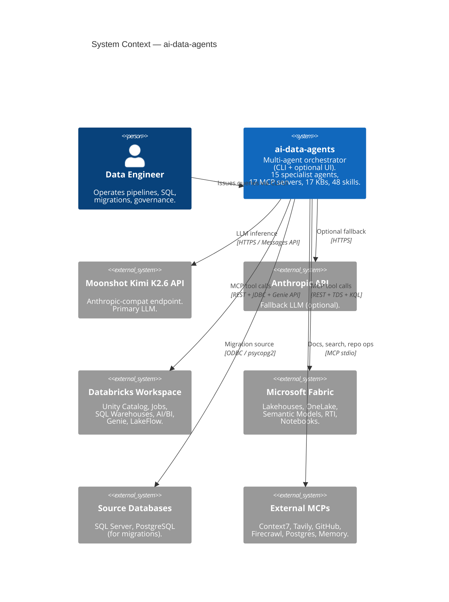
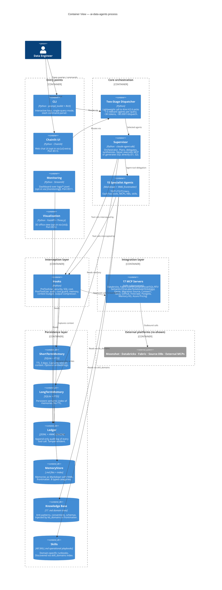
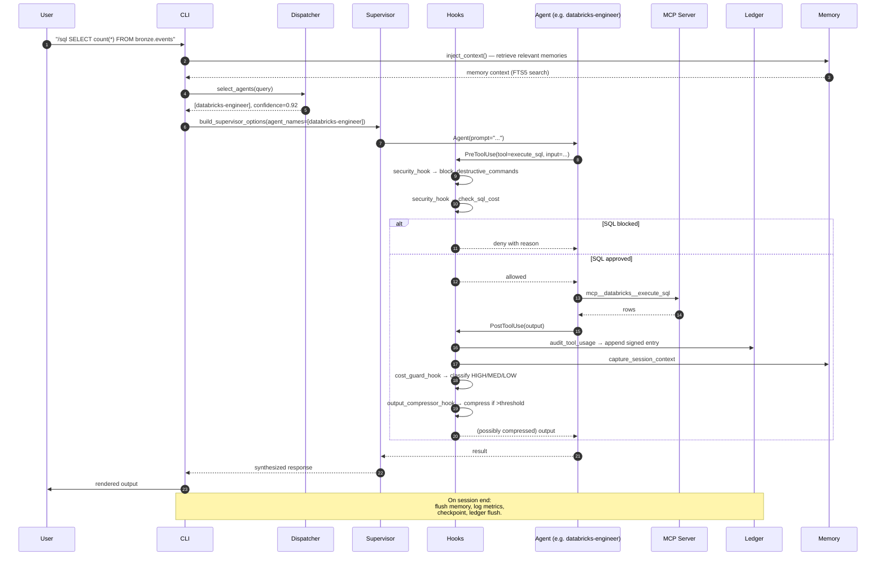

# Architecture — ai-data-agents

> Status: living document, updated when major architectural decisions land.
> Last updated: 2026-05-22 (v2.3.0 → v3.0 refactor in progress)

This document describes the system at C4 levels 1 (System Context) and 2 (Container). Component-level (level 3) decisions live in `docs/adr/`.

---

## 1. System Context (C4 — Level 1)

`ai-data-agents` is an **on-machine multi-agent orchestrator** that automates Data Engineering tasks on Databricks and Microsoft Fabric. It runs locally on the user's workstation, talks to LLM providers and data platforms over the network, and reads/writes the user's local files for outputs.

### Key external interactions

| Direction | Counterparty | Protocol | Purpose |
|---|---|---|---|
| Outbound | Moonshot Kimi API | HTTPS Messages API | Primary LLM for all agents (Anthropic-compat endpoint at `api.moonshot.ai/anthropic`) |
| Outbound | Databricks REST + JDBC | HTTPS / TDS | Tool calls for SQL, jobs, pipelines, Unity Catalog, AI/BI |
| Outbound | Microsoft Fabric REST + TDS + KQL | HTTPS | Lakehouse, Semantic Models, RTI, OneLake, Notebooks |
| Outbound | SQL Server / PostgreSQL | ODBC / pgwire | Read-only metadata extraction for migrations |
| Outbound | External MCP servers | stdio (npx/uvx subprocess) | Context7, Tavily, GitHub, Firecrawl, Memory KG |

### Trust boundaries

1. **User workstation** — the Trusted Computing Base. Holds `.env` with all credentials.
2. **Network** — untrusted. All credentials transit via TLS to platform APIs.
3. **Subprocess MCP servers** — partially trusted. They execute with the user's credentials but only their declared toolset; hooks intercept all calls.
4. **LLM providers** — untrusted with sensitive data. The output compressor strips large payloads; the security hook blocks credential echoing.

---

## 2. Container View (C4 — Level 2)

Inside `ai-data-agents`, the runtime divides into containers (logical, not Docker containers) that play distinct roles.

### Containers explained

#### Entry points (4)
- **CLI** (`main.py`, ~1.7K LOC): primary interface. `prompt_toolkit` with persistent history. Slash commands parsed via `commands/parser.py`. Streaming output via Rich.
- **Chainlit UI** (`ui/chainlit_app.py`, ~2.1K LOC): web chat, opt-in via `pip install ".[ui]"`. Mirror of CLI capabilities.
- **Monitoring** (`monitoring/app.py`, Streamlit): dashboard reading `logs/audit.jsonl`, `logs/sessions.jsonl`, `logs/workflows.jsonl`.
- **Visualization** (`visualization/server.py`, FastAPI + Three.js): 3D scene of agents in motion. Tailing JSONLs via WebSocket. Niche, demo-oriented.

#### Core orchestration (3 logical containers)
- **Two-Stage Dispatcher** (`agents/dispatcher.py`): solves the "Kimi K2.6 chokes on huge prompts" problem. Calls the LLM with only agent names+descriptions (~3K tokens) to pick 1-5 relevant agents. Confidence-based fallback expands to all agents if confidence < 60%.
- **Supervisor** (`agents/supervisor.py` + `agents/prompts/supervisor_prompt.py`): the orchestrator. Reads the Constitution (S1–S7), runs Clarity Checkpoint (DOMA), delegates via Agent tool. Never executes MCP directly.
- **Specialist agents** (`agents/registry/*.md`): 15 agents defined declaratively. Loaded by `agents/loader.py` into `AgentDefinition` from the SDK. Each carries: tools, MCP servers, KB domains, skill domains, tier (T0/T1/T2/T3), max_turns, effort.

#### Interception layer
- **Hooks** (`hooks/*.py` + `compression/`, `workflow/`): 11 hook files. PreToolUse blocks destructive commands and expensive SQL. PostToolUse audits, classifies cost (HIGH/MEDIUM/LOW), captures memory context, tracks the context budget (70%/80%/95% thresholds), and compresses verbose tool outputs. The session lifecycle hook initializes ShortTermMemory and the Ledger session key.

#### Integration layer
- **17 MCP servers** registered in `config/mcp_servers.py::ALL_MCP_CONFIGS`:
  - **8 custom**: `azure_pricing`, `databricks_genie`, `fabric_notebook`, `fabric_onelake`, `fabric_ontology`, `fabric_semantic`, `fabric_sql`, `migration_source`. Each has its own `server.py` in `mcp_servers/<name>/`.
  - **9 external** (subprocess via npx/uvx): `context7`, `databricks` (Databricks-Solutions wrapper), `fabric` (community + official), `fabric_rti`, `firecrawl`, `github`, `memory_mcp`, `postgres`, `tavily`.
  - 4 are **always active** (no credentials required): `context7`, `memory_mcp`, `fabric_ontology` (uses `az login`), `azure_pricing`.

#### Persistence layer
- **ShortTermMemory** (`memory/short_term.py`): SQLite with FTS5 + optional fastembed. Session-scoped, TTL 3 days, isolated per `PROJECT_ID`.
- **LongTermMemory** (`memory/long_term.py`): SQLite FTS5 + optional embeddings. Persistent semantic search.
- **Ledger** (`memory/ledger.py`): HMAC-SHA256-signed audit JSONL. Per-session key. Tamper-evident chain.
- **MemoryStore** (`memory/store.py`): `.md` files with YAML frontmatter, 8 typed categories (USER, FEEDBACK, ARCHITECTURE, PROGRESS, DATA_ASSET, PLATFORM_DECISION, PIPELINE_STATUS, LESSON_LEARNED). Decay rules per type.
- **Knowledge Base** (`kb/`): 17 domains × ~7 .md files each. Agents discover via `kb_domains` in frontmatter. Optional injection of `index.md` into system prompt.
- **Skills** (`skills/`): 48 SKILL.md operational playbooks. Discovered via `skill_domains` indexing. Read by agents via `Read` tool when needed.

---

## 3. Query lifecycle (sequence)

A typical query flows through the containers in this order:

---

## 4. Cross-cutting concerns

### Cost control
- **Recompute on egress**: `utils/pricing.py` recalculates cost using Moonshot's real price table; the SDK uses Anthropic Sonnet prices and inflates ~5×.
- **Tier-based budget**: `tier_turns_map` and `tier_effort_map` cap each agent's resources by role.
- **Cost guard hook**: classifies each tool call and alerts at 5+ HIGH ops or estimated cost over `MAX_BUDGET_USD`.
- **Output compressor**: caps SQL rows, file lines, list items; reduces ~40-70% of tool output tokens before they reach the LLM.

### Security
- **Constitution S1–S7**: invariant rules enforced both at the supervisor system prompt and at hook level.
- **Pre-tool hooks**: pattern-block destructive shell commands (22 regex patterns), evasion attempts (base64, eval, xargs+rm), and expensive SQL (`SELECT *` without `WHERE`/`LIMIT`).
- **Ledger HMAC**: per-session key signs every audit entry. Tampering invalidates the chain.
- **Config drift detection**: `config/snapshot.py` freezes settings at startup; drift detection in runtime flags potential prompt-injection attempts.

### Observability
- `logs/app.jsonl` — structured logs (JSONLFormatter).
- `logs/audit.jsonl` — every tool call with HMAC signature.
- `logs/sessions.jsonl` — per-session cost/turns/duration metrics.
- `logs/workflows.jsonl` — workflow steps + clarity checkpoints + agent delegations.
- `logs/compression.jsonl` — output compression metrics.

### Extensibility
- New agent → drop a `.md` in `agents/registry/`, no code change.
- New MCP server → follow `mcp_servers/_template/` + register in `ALL_MCP_CONFIGS`.
- New KB domain → drop a directory under `kb/`, reference from agent `kb_domains`.
- New skill → drop a `SKILL.md` under `skills/<domain>/<name>/`.
- New slash command → entry in `config/commands.yaml`.

---

## 5. What this architecture explicitly is NOT

- It is **not** a generic agent framework (CrewAI/LangGraph). Agents and MCPs are tightly bound to Databricks + Fabric.
- It is **not** a SaaS service. There is no multi-tenant tier, no API gateway, no managed deployment. The user runs the process locally.
- It is **not** a no-code product. It assumes Python, Databricks/Fabric credentials, and CLI/Python familiarity.
- It is **not** a chat-only product. The CLI is primary; UIs are optional extras.

---

## 6. Where to find the details

| Question | Look here |
|---|---|
| Why a specific architecture choice? | `docs/adr/ADR-XXX-*.md` |
| What are the inviolable rules? | `kb/constitution.md` |
| How does an agent get configured? | `agents/registry/_template.md` |
| How does memory work end-to-end? | `memory/` + `docs/adr/ADR-002-memory-three-layers.md` |
| What hooks intercept calls? | `hooks/` + `agents/supervisor.py::build_supervisor_options` |
| What MCPs exist and what they expose? | `mcp_servers/` + `docs/refactor-v3/inventory.md` |
| What slash commands are available? | `config/commands.yaml` |
| How is cost computed and capped? | `utils/pricing.py` + `hooks/cost_guard_hook.py` |
| What is the refactor roadmap? | `docs/refactor-v3/PLAN.md` |

---

*This document is the source of truth for system-level architecture. When the architecture changes, this file changes first (in the same PR).*
